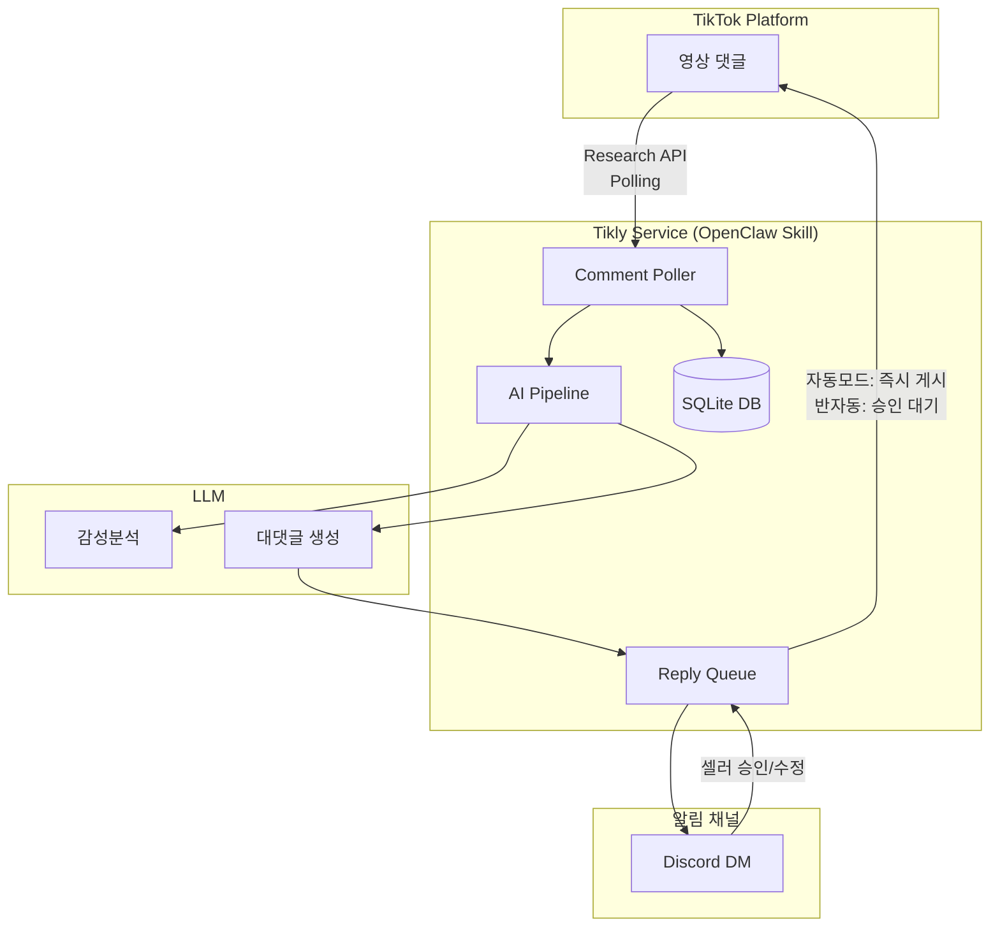
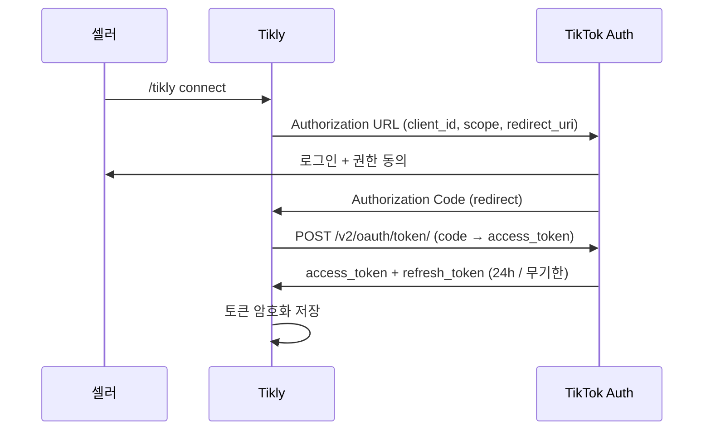

# D001 — Tikly 시스템 아키텍처 설계

## 1. 시스템 아키텍처



### 핵심 플로우

```
[5분 주기 폴링] → 새 댓글 감지 → 감성분석 + 카테고리 분류
  → 대댓글 초안 생성 → (자동모드) 즉시 게시 / (반자동) Discord 알림 → 셀러 승인 → 게시
```

---

## 2. TikTok API 연동 설계

### 2.1 API 현황 (2026-02 기준)

| 기능 | API | Scope | 상태 |
|------|-----|-------|------|
| **댓글 읽기** | Research API `/v2/research/video/comment/list/` | `research.data.basic` | ✅ 사용 가능 (학술/비즈니스 승인 필요) |
| **댓글 쓰기 (대댓글)** | 공식 API 없음 | — | ⚠️ 아래 대안 참고 |
| **영상 게시** | Content Posting API `/v2/post/publish/video/init/` | `video.publish` | ✅ (참고용) |

#### ⚠️ 댓글 쓰기 제약 및 대안

TikTok은 공식 댓글 작성/대댓글 API를 제공하지 않음. MVP 대안:

1. **Phase 1 (MVP):** AI가 대댓글 초안을 생성 → Discord로 셀러에게 전달 → **셀러가 수동으로 TikTok에 붙여넣기**
2. **Phase 2:** Browser Automation (Playwright) 으로 셀러 계정 세션을 통해 자동 게시
3. **Phase 3:** TikTok Business API 또는 향후 공식 Comment API 출시 시 마이그레이션

### 2.2 OAuth 2.0 플로우



**Scopes:**
- `research.data.basic` — 댓글 읽기
- `user.info.basic` — 사용자 정보

**토큰 관리:**
- Access token: 24시간 유효 → 만료 전 자동 refresh
- Refresh token: 무기한 (revoke 시까지)

### 2.3 Rate Limits & Polling 전략

| 항목 | 제한 |
|------|------|
| Research API 일일 쿼리 | 1,000 requests/day |
| 댓글 최대 조회 | 100개/request |

**Polling 전략:**
- 기본 주기: **5분** (영상당)
- 신규 영상 (24h 이내): **2분** 주기
- 오래된 영상 (7일+): **30분** 주기
- cursor 기반 증분 조회 (이전 cursor 저장, 새 댓글만 처리)
- 일일 쿼터 관리: 영상 수 × 주기 ≤ 1,000/day

**Webhook:** TikTok은 댓글에 대한 Webhook을 제공하지 않음. Polling만 가능.

---

## 3. AI 파이프라인 설계

### 3.1 파이프라인 흐름

```
댓글 수집 → 전처리 → 감성분석 → 카테고리 분류 → 응답 생성 → 품질 검증
```

### 3.2 전처리

- 이모지 보존 (감성 신호)
- 멘션(@) 제거
- 언어 감지 (한/베/영)
- 스팸 필터링 (URL, 반복 문자)

### 3.3 감성분석 + 카테고리 분류 프롬프트

```
You are a TikTok comment analyst for a beauty/commerce seller.

Analyze the following comment and return JSON:
{
  "sentiment": "positive" | "negative" | "neutral" | "question",
  "category": "purchase_intent" | "product_question" | "compliment" | "complaint" | "spam" | "other",
  "language": "ko" | "vi" | "en" | "other",
  "priority": 1-5,
  "needs_reply": true | false
}

Comment: "{comment_text}"
```

### 3.4 대댓글 생성 프롬프트

```
You are a friendly TikTok seller assistant for brand "{brand_name}".

Rules:
- Reply in the SAME language as the comment
- Keep under 150 characters (TikTok comment limit)
- Use 1-2 relevant emojis
- Be warm, authentic, not robotic
- For purchase_intent: include purchase link or DM guidance
- For complaint: empathize first, then offer solution
- For compliment: thank sincerely
- Match the seller's tone: {tone_style}

Comment: "{comment_text}"
Sentiment: {sentiment}
Category: {category}

Reply:
```

### 3.5 다국어 처리

| 언어 | 감지 | 응답 |
|------|------|------|
| 한국어 | langdetect / LLM | 한국어로 응답 |
| 베트남어 | langdetect / LLM | 베트남어로 응답 |
| 영어 | langdetect / LLM | 영어로 응답 |
| 기타 | fallback to 영어 | 영어로 응답 |

---

## 4. OpenClaw 스킬 구조

### 4.1 디렉토리 구조

```
C:\TEST\MAITOK\
├── docs/
│   ├── README.md
│   ├── A001-PRD.md
│   └── D001-architecture.md
├── skill/
│   ├── SKILL.md
│   ├── tikly.ts            # 메인 스킬 로직
│   ├── tiktok-client.ts    # TikTok API 클라이언트
│   ├── ai-pipeline.ts      # 감성분석 + 대댓글 생성
│   ├── comment-poller.ts   # 폴링 스케줄러
│   ├── db.ts               # SQLite 데이터 레이어
│   └── types.ts            # 타입 정의
├── package.json
├── tsconfig.json
└── .env                    # API 키 (git 무시)
```

### 4.2 SKILL.md 초안

```markdown
# Tikly — TikTok Comment AI Assistant

TikTok 셀러를 위한 AI 댓글 분석 및 자동 대댓글 서비스.

## Commands

- `/tikly connect` — TikTok 계정 연결 (OAuth)
- `/tikly watch <video_url>` — 영상 모니터링 시작
- `/tikly unwatch <video_url>` — 영상 모니터링 중지
- `/tikly status` — 모니터링 현황
- `/tikly mode auto|semi` — 자동/반자동 모드 전환
- `/tikly tone <style>` — 응답 톤 설정 (friendly/professional/casual)
- `/tikly stats [period]` — 분석 통계

## Settings

| Key | Type | Default | Description |
|-----|------|---------|-------------|
| tiktok_client_id | string | — | TikTok App Client ID |
| tiktok_client_secret | string | — | TikTok App Client Secret |
| mode | enum | semi | auto: 즉시 게시 / semi: 승인 후 게시 |
| poll_interval_sec | number | 300 | 폴링 주기 (초) |
| reply_tone | string | friendly | 응답 톤 스타일 |
| max_daily_replies | number | 100 | 일일 최대 대댓글 수 |
| languages | string[] | ["ko","vi","en"] | 지원 언어 |
```

### 4.3 설정 파라미터

| 파라미터 | 필수 | 설명 |
|----------|------|------|
| `TIKTOK_CLIENT_ID` | ✅ | TikTok Developer App ID |
| `TIKTOK_CLIENT_SECRET` | ✅ | TikTok Developer App Secret |
| `LLM_MODEL` | ❌ | 사용할 LLM (기본: claude-sonnet) |
| `NOTIFY_CHANNEL` | ❌ | Discord 알림 채널 ID |
| `MODE` | ❌ | `auto` / `semi` (기본: semi) |

---

## 5. 데이터 모델

### 5.1 댓글 (comments)

```sql
CREATE TABLE comments (
  id            TEXT PRIMARY KEY,   -- TikTok comment ID
  video_id      TEXT NOT NULL,
  text          TEXT NOT NULL,
  parent_id     TEXT,               -- parent comment ID (null = top-level)
  like_count    INTEGER DEFAULT 0,
  reply_count   INTEGER DEFAULT 0,
  created_at    INTEGER NOT NULL,   -- unix timestamp
  fetched_at    TEXT DEFAULT (datetime('now')),
  language      TEXT,               -- detected language
  sentiment     TEXT,               -- positive/negative/neutral/question
  category      TEXT,               -- purchase_intent/complaint/...
  priority      INTEGER DEFAULT 3,
  needs_reply   BOOLEAN DEFAULT 0,
  reply_status  TEXT DEFAULT 'pending'  -- pending/generated/approved/posted/skipped
);
```

### 5.2 대댓글 (replies)

```sql
CREATE TABLE replies (
  id            INTEGER PRIMARY KEY AUTOINCREMENT,
  comment_id    TEXT NOT NULL REFERENCES comments(id),
  reply_text    TEXT NOT NULL,
  generated_at  TEXT DEFAULT (datetime('now')),
  approved_at   TEXT,
  posted_at     TEXT,
  status        TEXT DEFAULT 'draft',  -- draft/approved/posted/rejected
  edited_text   TEXT                   -- 셀러가 수정한 경우
);
```

### 5.3 셀러 설정 (seller_config)

```sql
CREATE TABLE seller_config (
  id                INTEGER PRIMARY KEY,
  tiktok_user_id    TEXT UNIQUE,
  tiktok_username   TEXT,
  access_token      TEXT,            -- 암호화 저장
  refresh_token     TEXT,            -- 암호화 저장
  token_expires_at  TEXT,
  mode              TEXT DEFAULT 'semi',
  reply_tone        TEXT DEFAULT 'friendly',
  max_daily_replies INTEGER DEFAULT 100,
  languages         TEXT DEFAULT '["ko","vi","en"]',
  created_at        TEXT DEFAULT (datetime('now')),
  updated_at        TEXT DEFAULT (datetime('now'))
);
```

### 5.4 모니터링 영상 (watched_videos)

```sql
CREATE TABLE watched_videos (
  id          INTEGER PRIMARY KEY AUTOINCREMENT,
  video_id    TEXT NOT NULL,
  video_url   TEXT,
  seller_id   INTEGER REFERENCES seller_config(id),
  last_cursor INTEGER DEFAULT 0,
  poll_interval_sec INTEGER DEFAULT 300,
  active      BOOLEAN DEFAULT 1,
  created_at  TEXT DEFAULT (datetime('now'))
);
```

---

## 6. MVP 기술 스택

| 영역 | 선택 | 사유 |
|------|------|------|
| **런타임** | Node.js 22+ (TypeScript) | OpenClaw 스킬 호환, Bun 대안 |
| **DB** | SQLite (better-sqlite3) | 단일 파일, 서버리스, MVP 충분 |
| **LLM** | Claude Sonnet (via OpenClaw) | 다국어 우수, 비용 효율 |
| **스케줄러** | setInterval + cron 표현식 | 외부 의존성 없음 |
| **알림** | Discord (OpenClaw 내장) | 기존 채널 활용 |
| **배포** | 로컬 OpenClaw Gateway | MVP는 로컬, 추후 VPS |

### MVP 제약사항

1. **댓글 쓰기 불가** → Phase 1은 초안 생성 + 셀러 수동 게시
2. **Research API 승인 필요** → TikTok Developer 신청 필수
3. **일일 1,000 API 호출** → 모니터링 영상 수 제한 (최대 ~10개 영상)

### Phase 로드맵

| Phase | 기능 | 예상 |
|-------|------|------|
| **1 (MVP)** | 댓글 분석 + 대댓글 초안 → Discord 알림 | 2주 |
| **2** | Browser Automation 자동 게시 | +2주 |
| **3** | 대시보드 UI, 멀티 셀러, 분석 리포트 | +4주 |
