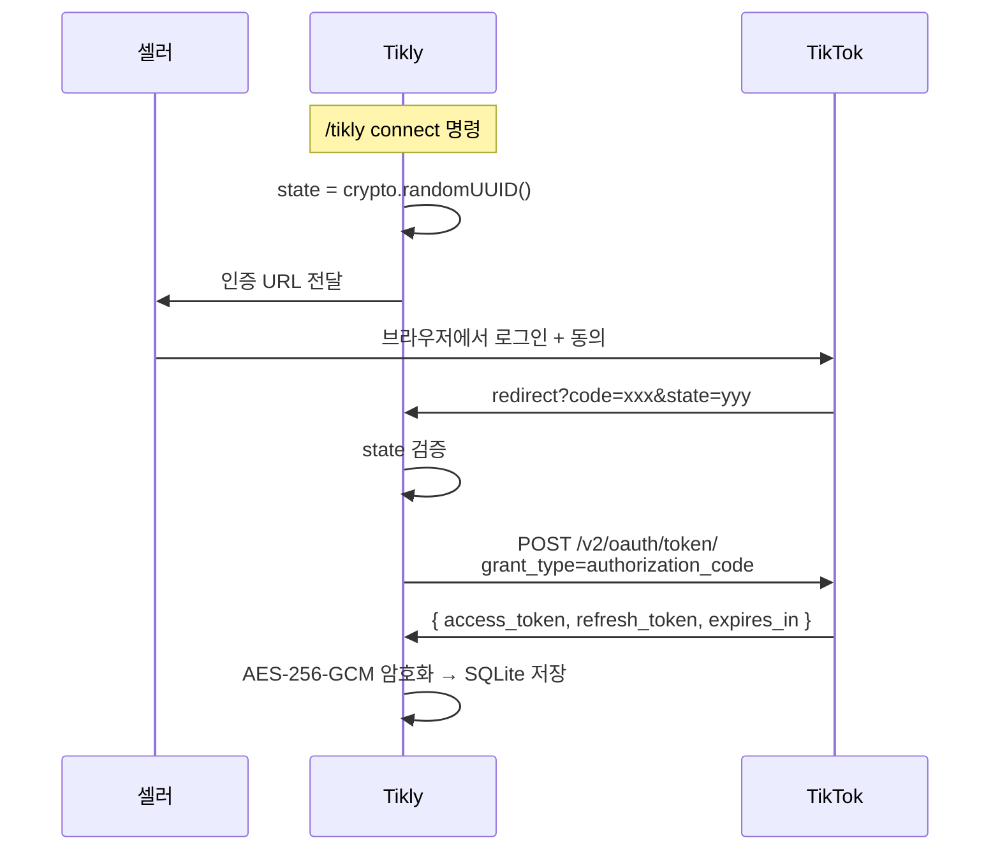
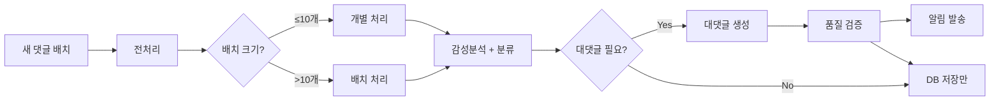
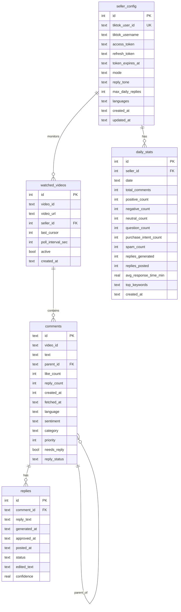

# D002 — Tikly 백엔드/인프라 상세 설계

## 1. 프로젝트 디렉토리 구조

```
MAITOK/
├── src/
│   ├── api/                    ← TikTok API 클라이언트
│   │   ├── tiktok-client.ts        # HTTP 클라이언트 (axios wrapper)
│   │   ├── oauth.ts                # OAuth 2.0 플로우
│   │   ├── comments.ts             # 댓글 CRUD 엔드포인트
│   │   ├── rate-limiter.ts         # 토큰 버킷 rate limiter
│   │   └── types.ts                # TikTok API 응답 타입
│   ├── ai/                     ← AI 분석 파이프라인
│   │   ├── pipeline.ts             # 메인 파이프라인 오케스트레이터
│   │   ├── sentiment.ts            # 감성분석 모듈
│   │   ├── reply-generator.ts      # 대댓글 생성 모듈
│   │   ├── classifier.ts           # 카테고리 분류기
│   │   ├── prompts.ts              # 프롬프트 템플릿 모음
│   │   └── batch.ts                # 배치 처리 로직
│   ├── db/                     ← SQLite 스키마 + 쿼리
│   │   ├── schema.ts               # DDL 정의 + 마이그레이션
│   │   ├── queries.ts              # 쿼리 함수 모음
│   │   ├── migrations/             # 버전별 마이그레이션 SQL
│   │   │   └── 001-initial.sql
│   │   └── index.ts                # DB 인스턴스 + 초기화
│   ├── notify/                 ← Discord/Telegram 알림
│   │   ├── discord.ts              # Discord webhook/bot
│   │   ├── telegram.ts             # Telegram bot (v2)
│   │   ├── templates.ts            # 알림 메시지 템플릿
│   │   └── reporter.ts             # 일일/주간 리포트 생성
│   ├── skill/                  ← OpenClaw 스킬 래퍼
│   │   ├── SKILL.md                # 스킬 정의
│   │   ├── tikly.ts                # 메인 스킬 엔트리포인트
│   │   └── commands.ts             # 커맨드 핸들러
│   ├── poller/                 ← 댓글 폴링 스케줄러
│   │   ├── scheduler.ts            # 폴링 주기 관리
│   │   └── dedup.ts                # 중복 방지 로직
│   └── utils/                  ← 공통 유틸
│       ├── crypto.ts               # 토큰 암호화/복호화
│       ├── logger.ts               # 구조화 로거
│       ├── lang-detect.ts          # 언어 감지
│       └── config.ts               # 설정 로더
├── config/
│   ├── default.ts                  # 기본 설정값
│   ├── development.ts
│   ├── production.ts
│   └── schema.ts                   # 설정 스키마 (Zod)
├── tests/
│   ├── api/
│   ├── ai/
│   ├── db/
│   └── fixtures/                   # 테스트 데이터
├── docs/
├── .env.example
├── package.json
├── tsconfig.json
└── vitest.config.ts
```

---

## 2. TikTok API 클라이언트 상세 설계

### 2.1 OAuth 2.0 플로우



**토큰 갱신 로직:**

```typescript
// src/api/oauth.ts
export class TikTokOAuth {
  private static TOKEN_REFRESH_BUFFER_MS = 5 * 60 * 1000; // 만료 5분 전 갱신

  async getValidToken(sellerId: number): Promise<string> {
    const config = db.getSellerConfig(sellerId);
    const expiresAt = new Date(config.token_expires_at).getTime();

    if (Date.now() >= expiresAt - TikTokOAuth.TOKEN_REFRESH_BUFFER_MS) {
      return this.refreshToken(sellerId, config.refresh_token);
    }
    return decrypt(config.access_token);
  }

  private async refreshToken(sellerId: number, encryptedRefresh: string): Promise<string> {
    const refreshToken = decrypt(encryptedRefresh);
    const resp = await this.client.post('/v2/oauth/token/', {
      client_key: env.TIKTOK_CLIENT_ID,
      client_secret: env.TIKTOK_CLIENT_SECRET,
      grant_type: 'refresh_token',
      refresh_token: refreshToken,
    });

    const { access_token, refresh_token, expires_in } = resp.data;
    db.updateSellerTokens(sellerId, {
      access_token: encrypt(access_token),
      refresh_token: encrypt(refresh_token),
      token_expires_at: new Date(Date.now() + expires_in * 1000).toISOString(),
    });
    return access_token;
  }
}
```

**토큰 암호화:**
- 알고리즘: AES-256-GCM
- 키 소스: `ENCRYPTION_KEY` 환경변수 (32바이트 hex)
- IV: 매 암호화 시 랜덤 12바이트 생성, ciphertext 앞에 prefix

### 2.2 댓글 Polling 모듈

```typescript
// src/poller/scheduler.ts
export class CommentPoller {
  private timers = new Map<string, NodeJS.Timeout>();

  /**
   * 영상별 동적 폴링 주기:
   * - 신규 (24h 이내): 2분
   * - 활성 (24h~7d):   5분
   * - 오래됨 (7d+):    30분
   */
  private getInterval(video: WatchedVideo): number {
    const ageMs = Date.now() - new Date(video.created_at).getTime();
    const DAY = 86_400_000;
    if (ageMs < DAY) return 2 * 60_000;
    if (ageMs < 7 * DAY) return 5 * 60_000;
    return 30 * 60_000;
  }

  async pollVideo(video: WatchedVideo): Promise<void> {
    const token = await oauth.getValidToken(video.seller_id);
    const { comments, cursor, hasMore } = await tiktokClient.getComments({
      video_id: video.video_id,
      cursor: video.last_cursor,
      max_count: 100,
      token,
    });

    // 중복 방지: comment ID 기반
    const existingIds = new Set(db.getCommentIds(video.video_id));
    const newComments = comments.filter(c => !existingIds.has(c.id));

    if (newComments.length > 0) {
      db.insertComments(newComments);
      db.updateVideoCursor(video.id, cursor);
      await pipeline.process(newComments);
    }

    // hasMore인 경우 즉시 다음 페이지 (rate limit 내에서)
    if (hasMore) {
      await rateLimiter.wait();
      video.last_cursor = cursor;
      await this.pollVideo(video);
    }
  }
}
```

**중복 방지 전략:**
1. **Primary**: TikTok comment ID (`comments.id` PK) — INSERT OR IGNORE
2. **Secondary**: `(video_id, text, created_at)` 복합 유니크 인덱스 (API 중복 응답 방어)
3. **Cursor 저장**: `watched_videos.last_cursor`에 마지막 cursor 저장, 항상 증분 조회

**재시도 로직:**
- HTTP 429 (Rate Limit): exponential backoff (1s → 2s → 4s → 8s, 최대 3회)
- HTTP 5xx: 3회 재시도 후 스킵, 다음 주기에 재시도
- 네트워크 오류: 즉시 1회 재시도 → 실패 시 로그 + 스킵

### 2.3 Rate Limiter

```typescript
// src/api/rate-limiter.ts
export class TokenBucketRateLimiter {
  private tokens: number;
  private lastRefill: number;

  constructor(
    private maxTokens: number = 6,        // 6 req/min (TikTok Research API)
    private refillRate: number = 6,        // tokens per interval
    private refillIntervalMs: number = 60_000, // 1분
  ) {
    this.tokens = maxTokens;
    this.lastRefill = Date.now();
  }

  async wait(): Promise<void> {
    this.refill();
    if (this.tokens > 0) {
      this.tokens--;
      return;
    }
    // 다음 토큰 충전까지 대기
    const waitMs = this.refillIntervalMs - (Date.now() - this.lastRefill);
    await new Promise(resolve => setTimeout(resolve, waitMs));
    this.refill();
    this.tokens--;
  }

  private refill(): void {
    const elapsed = Date.now() - this.lastRefill;
    if (elapsed >= this.refillIntervalMs) {
      this.tokens = this.maxTokens;
      this.lastRefill = Date.now();
    }
  }
}

// 일일 쿼터 관리
export class DailyQuotaTracker {
  private dailyCount = 0;
  private resetDate = new Date().toDateString();

  canMakeRequest(): boolean {
    this.checkReset();
    return this.dailyCount < 1000; // Research API 일일 한도
  }

  record(): void {
    this.dailyCount++;
  }

  private checkReset(): void {
    const today = new Date().toDateString();
    if (today !== this.resetDate) {
      this.dailyCount = 0;
      this.resetDate = today;
    }
  }
}
```

### 2.4 API 응답 타입 정의

```typescript
// src/api/types.ts

/** TikTok OAuth 토큰 응답 */
export interface TikTokTokenResponse {
  access_token: string;
  refresh_token: string;
  expires_in: number;       // 초 단위 (86400 = 24h)
  open_id: string;
  scope: string;
  token_type: 'Bearer';
}

/** TikTok Research API — 댓글 조회 응답 */
export interface TikTokCommentListResponse {
  data: {
    comments: TikTokComment[];
    cursor: number;
    has_more: boolean;
  };
  error: {
    code: string;
    message: string;
    log_id: string;
  };
}

export interface TikTokComment {
  id: string;
  video_id: string;
  text: string;
  parent_comment_id: string;   // 빈 문자열 = 최상위 댓글
  like_count: number;
  reply_count: number;
  create_time: number;         // unix timestamp
}

/** 내부 처리용 확장 댓글 타입 */
export interface AnalyzedComment extends TikTokComment {
  language: 'ko' | 'vi' | 'en' | 'other';
  sentiment: 'positive' | 'negative' | 'neutral' | 'question';
  category: CommentCategory;
  priority: number;            // 1(최고) ~ 5(최저)
  needs_reply: boolean;
}

export type CommentCategory =
  | 'purchase_intent'
  | 'product_question'
  | 'compliment'
  | 'complaint'
  | 'spam'
  | 'other';

/** 대댓글 생성 결과 */
export interface GeneratedReply {
  comment_id: string;
  reply_text: string;
  confidence: number;          // 0.0 ~ 1.0
  tone: 'friendly' | 'professional' | 'casual';
}

/** 폴링 설정 */
export interface PollConfig {
  video_id: string;
  interval_ms: number;
  last_cursor: number;
  active: boolean;
}
```

---

## 3. AI 파이프라인 상세

### 3.1 파이프라인 오케스트레이션



### 3.2 감성분석 프롬프트

```typescript
// src/ai/prompts.ts

export const SENTIMENT_PROMPT = `You are a TikTok comment analyst for a beauty/commerce seller.

Analyze each comment and return a JSON array. For each comment:
{
  "id": "<comment_id>",
  "sentiment": "positive" | "negative" | "neutral" | "question",
  "category": "purchase_intent" | "product_question" | "compliment" | "complaint" | "spam" | "other",
  "language": "ko" | "vi" | "en" | "other",
  "priority": 1-5,
  "needs_reply": true | false,
  "reason": "<1줄 판단 근거>"
}

Priority guide:
- 1: 구매의도 (즉시 대응 필요)
- 2: 불만/클레임 (빠른 대응 필요)
- 3: 질문 (답변 필요)
- 4: 칭찬 (감사 표현 권장)
- 5: 스팸/기타 (무시 가능)

Comments:
{comments_json}`;
```

**다국어 예시:**

| 언어 | 댓글 예시 | 예상 분류 |
|------|-----------|-----------|
| 🇰🇷 한국어 | "이거 얼마에요? 사고싶어요" | purchase_intent, priority: 1 |
| 🇰🇷 한국어 | "배송 왔는데 색상이 달라요" | complaint, priority: 2 |
| 🇻🇳 베트남어 | "Giá bao nhiêu vậy shop?" | purchase_intent, priority: 1 |
| 🇻🇳 베트남어 | "Sản phẩm này dùng tốt lắm 😍" | compliment, priority: 4 |
| 🇬🇧 영어 | "Does this ship to the US?" | product_question, priority: 3 |
| 🇬🇧 영어 | "Scam!! Don't buy!!" | complaint, priority: 2 |

### 3.3 대댓글 생성 프롬프트

```typescript
export const REPLY_PROMPT = `You are a TikTok seller assistant for brand "{brand_name}".
Seller tone: {tone_style}

Rules:
- Reply in the SAME language as the comment
- Keep under 150 characters
- Use 1-2 relevant emojis
- Be warm and authentic, never robotic
- NEVER mention you are AI

Tone guidelines:
{tone_guidelines}

Comment: "{comment_text}"
Sentiment: {sentiment}
Category: {category}
Language: {language}

Reply:`;

export const TONE_GUIDELINES: Record<string, string> = {
  friendly: `- 반말/존댓말: 댓글 톤에 맞춤
- 이모지 적극 활용 (😊💕🔥)
- 친근한 감탄사 사용 ("우와!", "맞아요~")
- 예: "우와 감사해요~ 💕 다음에도 좋은 제품 준비할게요!"`,

  professional: `- 항상 존댓말 사용
- 이모지 절제 (1개 이하)
- 정확하고 신뢰감 있는 톤
- 예: "문의 감사합니다. 해당 제품은 내일 재입고 예정입니다."`,

  casual: `- 친구같은 편한 톤
- 이모지와 줄임말 자유롭게
- TikTok 트렌드 반영
- 예: "ㅋㅋ 진짜 이건 사야됨 🔥 링크 프로필에 있어요!"`,
};
```

### 3.4 카테고리 분류 로직

```typescript
// src/ai/classifier.ts

/**
 * 2단계 분류: 키워드 사전 필터 → LLM 확인
 * 스팸/명확한 패턴은 LLM 호출 없이 처리하여 비용 절감
 */
export class CommentClassifier {
  private static SPAM_PATTERNS = [
    /https?:\/\//i,                    // URL 포함
    /(.)\1{5,}/,                       // 같은 문자 6회 이상 반복
    /follow me|follow back|f4f/i,      // 팔로우 요청
    /check.*profile|link.*bio/i,       // 프로필 유도
  ];

  private static PURCHASE_KEYWORDS = {
    ko: ['얼마', '가격', '배송', '사고싶', '구매', '재입고', '사이즈', '할인'],
    vi: ['giá', 'bao nhiêu', 'ship', 'giao hàng', 'mua', 'size', 'còn hàng'],
    en: ['price', 'how much', 'shipping', 'buy', 'restock', 'size', 'discount'],
  };

  classify(comment: string, language: string): { category?: CommentCategory; confidence: number } {
    // Stage 1: 스팸 패턴 체크 (LLM 호출 불필요)
    if (this.SPAM_PATTERNS.some(p => p.test(comment))) {
      return { category: 'spam', confidence: 0.95 };
    }

    // Stage 2: 구매의도 키워드 체크 (빠른 판별)
    const keywords = this.PURCHASE_KEYWORDS[language] ?? this.PURCHASE_KEYWORDS.en;
    if (keywords.some(kw => comment.toLowerCase().includes(kw))) {
      return { category: 'purchase_intent', confidence: 0.7 }; // LLM 확인 권장
    }

    // Stage 3: LLM으로 정밀 분류 필요
    return { category: undefined, confidence: 0 };
  }
}
```

### 3.5 배치 처리 vs 실시간 처리 전략

| 전략 | 조건 | 처리 방식 |
|------|------|-----------|
| **실시간** | priority 1~2 (구매의도, 클레임) | 댓글 수집 즉시 개별 LLM 호출 |
| **배치** | priority 3~5 | 최대 20개 묶어서 단일 LLM 호출 |
| **스킵** | 스팸 (사전 필터 통과) | LLM 호출 없음 |

```typescript
// src/ai/batch.ts
export class BatchProcessor {
  private queue: TikTokComment[] = [];
  private timer: NodeJS.Timeout | null = null;
  private static MAX_BATCH = 20;
  private static FLUSH_INTERVAL_MS = 30_000; // 30초

  add(comment: TikTokComment, preClassification?: { category?: string; confidence: number }): void {
    // 우선순위 높은 것은 즉시 처리
    if (preClassification?.category === 'purchase_intent' ||
        preClassification?.category === 'complaint') {
      this.processImmediate(comment);
      return;
    }

    this.queue.push(comment);
    if (this.queue.length >= BatchProcessor.MAX_BATCH) {
      this.flush();
    } else if (!this.timer) {
      this.timer = setTimeout(() => this.flush(), BatchProcessor.FLUSH_INTERVAL_MS);
    }
  }

  private async flush(): Promise<void> {
    if (this.timer) { clearTimeout(this.timer); this.timer = null; }
    if (this.queue.length === 0) return;

    const batch = this.queue.splice(0, BatchProcessor.MAX_BATCH);
    // 단일 LLM 호출로 전체 배치 분석
    const results = await aiPipeline.analyzeBatch(batch);
    // ...저장 및 알림
  }
}
```

### 3.6 비용 추정

**모델:** Claude Sonnet (via OpenClaw)

| 항목 | 토큰 추정 | 호출 빈도 | 월간 토큰 |
|------|-----------|-----------|-----------|
| **감성분석 (배치 20개)** | 입력 ~800, 출력 ~600 | 50회/일 | 2.1M |
| **감성분석 (실시간)** | 입력 ~200, 출력 ~100 | 20회/일 | 180K |
| **대댓글 생성** | 입력 ~300, 출력 ~80 | 30회/일 | 342K |
| **합계** | | | **~2.6M tokens/월** |

**비용 (Claude Sonnet 기준):**
- 입력: ~1.6M × $3/1M = $4.80
- 출력: ~1.0M × $15/1M = $15.00
- **월간 예상: ~$20/셀러** (일 100댓글 기준)

**비용 최적화 전략:**
1. 스팸 사전 필터로 LLM 호출 30% 절감
2. 배치 처리로 시스템 프롬프트 중복 제거
3. 간단한 칭찬 댓글은 템플릿 응답 (LLM 호출 불필요)
4. 캐시: 유사 댓글 패턴 → 이전 분석 결과 재활용

---

## 4. 데이터베이스 상세 (SQLite)

### 4.1 전체 ERD



### 4.2 DDL

```sql
-- src/db/migrations/001-initial.sql

-- 마이그레이션 버전 추적
CREATE TABLE IF NOT EXISTS _migrations (
  version   INTEGER PRIMARY KEY,
  name      TEXT NOT NULL,
  applied_at TEXT DEFAULT (datetime('now'))
);

-- 셀러 설정
CREATE TABLE seller_config (
  id                INTEGER PRIMARY KEY AUTOINCREMENT,
  tiktok_user_id    TEXT UNIQUE,
  tiktok_username   TEXT,
  access_token      TEXT,
  refresh_token     TEXT,
  token_expires_at  TEXT,
  mode              TEXT NOT NULL DEFAULT 'semi' CHECK (mode IN ('auto', 'semi')),
  reply_tone        TEXT NOT NULL DEFAULT 'friendly' CHECK (reply_tone IN ('friendly', 'professional', 'casual')),
  max_daily_replies INTEGER NOT NULL DEFAULT 100,
  languages         TEXT NOT NULL DEFAULT '["ko","vi","en"]',
  created_at        TEXT NOT NULL DEFAULT (datetime('now')),
  updated_at        TEXT NOT NULL DEFAULT (datetime('now'))
);

-- 모니터링 영상
CREATE TABLE watched_videos (
  id                INTEGER PRIMARY KEY AUTOINCREMENT,
  video_id          TEXT NOT NULL,
  video_url         TEXT,
  seller_id         INTEGER NOT NULL REFERENCES seller_config(id) ON DELETE CASCADE,
  last_cursor       INTEGER NOT NULL DEFAULT 0,
  poll_interval_sec INTEGER NOT NULL DEFAULT 300,
  active            INTEGER NOT NULL DEFAULT 1,
  created_at        TEXT NOT NULL DEFAULT (datetime('now')),
  UNIQUE (video_id, seller_id)
);

-- 댓글
CREATE TABLE comments (
  id            TEXT PRIMARY KEY,
  video_id      TEXT NOT NULL,
  text          TEXT NOT NULL,
  parent_id     TEXT REFERENCES comments(id),
  like_count    INTEGER NOT NULL DEFAULT 0,
  reply_count   INTEGER NOT NULL DEFAULT 0,
  created_at    INTEGER NOT NULL,
  fetched_at    TEXT NOT NULL DEFAULT (datetime('now')),
  language      TEXT CHECK (language IN ('ko', 'vi', 'en', 'other')),
  sentiment     TEXT CHECK (sentiment IN ('positive', 'negative', 'neutral', 'question')),
  category      TEXT CHECK (category IN ('purchase_intent', 'product_question', 'compliment', 'complaint', 'spam', 'other')),
  priority      INTEGER DEFAULT 3 CHECK (priority BETWEEN 1 AND 5),
  needs_reply   INTEGER NOT NULL DEFAULT 0,
  reply_status  TEXT NOT NULL DEFAULT 'pending' CHECK (reply_status IN ('pending', 'generated', 'approved', 'posted', 'skipped'))
);

-- 대댓글
CREATE TABLE replies (
  id            INTEGER PRIMARY KEY AUTOINCREMENT,
  comment_id    TEXT NOT NULL REFERENCES comments(id) ON DELETE CASCADE,
  reply_text    TEXT NOT NULL,
  generated_at  TEXT NOT NULL DEFAULT (datetime('now')),
  approved_at   TEXT,
  posted_at     TEXT,
  status        TEXT NOT NULL DEFAULT 'draft' CHECK (status IN ('draft', 'approved', 'posted', 'rejected')),
  edited_text   TEXT,
  confidence    REAL DEFAULT 0.0
);

-- 일일 통계
CREATE TABLE daily_stats (
  id                    INTEGER PRIMARY KEY AUTOINCREMENT,
  seller_id             INTEGER NOT NULL REFERENCES seller_config(id) ON DELETE CASCADE,
  date                  TEXT NOT NULL,
  total_comments        INTEGER NOT NULL DEFAULT 0,
  positive_count        INTEGER NOT NULL DEFAULT 0,
  negative_count        INTEGER NOT NULL DEFAULT 0,
  neutral_count         INTEGER NOT NULL DEFAULT 0,
  question_count        INTEGER NOT NULL DEFAULT 0,
  purchase_intent_count INTEGER NOT NULL DEFAULT 0,
  spam_count            INTEGER NOT NULL DEFAULT 0,
  replies_generated     INTEGER NOT NULL DEFAULT 0,
  replies_posted        INTEGER NOT NULL DEFAULT 0,
  avg_response_time_min REAL,
  top_keywords          TEXT,
  created_at            TEXT NOT NULL DEFAULT (datetime('now')),
  UNIQUE (seller_id, date)
);
```

### 4.3 인덱스 전략

```sql
-- 댓글 조회 최적화
CREATE INDEX idx_comments_video_id ON comments(video_id);
CREATE INDEX idx_comments_video_created ON comments(video_id, created_at DESC);
CREATE INDEX idx_comments_reply_status ON comments(reply_status) WHERE needs_reply = 1;
CREATE INDEX idx_comments_priority ON comments(priority ASC) WHERE reply_status = 'pending';
CREATE INDEX idx_comments_sentiment ON comments(video_id, sentiment);

-- 대댓글 조회
CREATE INDEX idx_replies_comment_id ON replies(comment_id);
CREATE INDEX idx_replies_status ON replies(status);

-- 영상 폴링
CREATE INDEX idx_watched_videos_active ON watched_videos(seller_id) WHERE active = 1;

-- 통계 조회
CREATE INDEX idx_daily_stats_seller_date ON daily_stats(seller_id, date DESC);
```

### 4.4 마이그레이션 계획

```typescript
// src/db/schema.ts
export class Migrator {
  private db: Database;

  async migrate(): Promise<void> {
    const applied = this.getAppliedVersions();
    const pending = this.getPendingMigrations(applied);

    for (const migration of pending) {
      this.db.transaction(() => {
        this.db.exec(migration.sql);
        this.db.prepare('INSERT INTO _migrations (version, name) VALUES (?, ?)')
          .run(migration.version, migration.name);
      })();
      console.log(`✅ Migration ${migration.version}: ${migration.name}`);
    }
  }
}

// 마이그레이션 파일 규칙:
// src/db/migrations/001-initial.sql     ← 초기 스키마
// src/db/migrations/002-add-stats.sql   ← daily_stats 추가
// src/db/migrations/003-xxx.sql         ← 순차 번호
```

**롤백 전략:**
- SQLite는 ALTER TABLE이 제한적 → 구조 변경 시 테이블 재생성 패턴 사용
- 각 마이그레이션에 up/down SQL 쌍 (down은 개발 환경에서만 사용)
- 프로덕션 롤백: DB 백업 파일에서 복원 (`tikly.db.bak`)

---

## 5. 알림 시스템 설계

### 5.1 Discord 연동

```typescript
// src/notify/discord.ts
export class DiscordNotifier {
  constructor(
    private webhookUrl?: string,  // webhook 모드
    private botToken?: string,    // bot 모드 (OpenClaw 내장)
    private channelId?: string,
  ) {}

  /** OpenClaw 내장 메시지 API 사용 (우선) */
  async sendViaOpenClaw(message: string, target: string): Promise<void> {
    // OpenClaw message tool 호출
  }

  /** Webhook 폴백 */
  async sendViaWebhook(embed: DiscordEmbed): Promise<void> {
    await fetch(this.webhookUrl!, {
      method: 'POST',
      headers: { 'Content-Type': 'application/json' },
      body: JSON.stringify({ embeds: [embed] }),
    });
  }
}
```

### 5.2 알림 템플릿

#### 구매의도 감지 알림 (긴급)
```
🔥 구매의도 댓글 감지!

📹 영상: {video_title}
💬 댓글: "{comment_text}"
👤 작성자: @{username}
📊 감성: {sentiment} | 카테고리: 구매의도
⏰ {time_ago}

💡 AI 대댓글 초안:
"{reply_draft}"

✅ 승인  |  ✏️ 수정  |  ❌ 스킵
```

#### 클레임/부정 댓글 알림 (긴급)
```
⚠️ 부정 댓글 감지!

📹 영상: {video_title}
💬 댓글: "{comment_text}"
👤 작성자: @{username}
❤️ 좋아요: {like_count} | 💬 답글: {reply_count}

💡 AI 대댓글 초안:
"{reply_draft}"

⚡ 즉시 대응을 권장합니다.
```

#### 감성 요약 알림 (일반)
```
📊 새 댓글 요약 ({count}개)

📹 {video_title}
✅ 긍정: {positive}개
❌ 부정: {negative}개
❓ 질문: {question}개
🛒 구매의도: {purchase}개
🚫 스팸: {spam}개

대댓글 초안 {draft_count}개 생성됨 → /tikly review
```

### 5.3 일일 리포트 포맷

```
📋 Tikly 일일 리포트 — {date}

━━━━━━━━━━━━━━━━━━━━━
📊 오늘의 댓글 현황
━━━━━━━━━━━━━━━━━━━━━
총 댓글: {total}개
├── 😊 긍정: {positive}개 ({positive_pct}%)
├── 😠 부정: {negative}개 ({negative_pct}%)
├── 🤔 질문: {question}개 ({question_pct}%)
├── 🛒 구매의도: {purchase}개 ({purchase_pct}%)
└── 🚫 스팸: {spam}개

━━━━━━━━━━━━━━━━━━━━━
💬 대댓글 현황
━━━━━━━━━━━━━━━━━━━━━
AI 생성: {generated}개
승인됨: {approved}개
게시됨: {posted}개
평균 응답 시간: {avg_response}분

━━━━━━━━━━━━━━━━━━━━━
🔑 핫 키워드 Top 5
━━━━━━━━━━━━━━━━━━━━━
1. {kw1} ({kw1_count}회)
2. {kw2} ({kw2_count}회)
3. {kw3} ({kw3_count}회)
4. {kw4} ({kw4_count}회)
5. {kw5} ({kw5_count}회)

━━━━━━━━━━━━━━━━━━━━━
⚡ 주의 필요
━━━━━━━━━━━━━━━━━━━━━
{highlights}

━━━━━━━━━━━━━━━━━━━━━
💰 AI 비용: ~${cost_today} (누적 ${cost_month})
```

---

## 6. 환경 설정

### 6.1 .env.example

```bash
# ===== TikTok API =====
TIKTOK_CLIENT_ID=your_client_key_here
TIKTOK_CLIENT_SECRET=your_client_secret_here
TIKTOK_REDIRECT_URI=http://localhost:3000/callback

# ===== AI / LLM =====
LLM_MODEL=claude-sonnet                # claude-sonnet | claude-haiku | gpt-4o-mini
LLM_MAX_TOKENS=1024
LLM_TEMPERATURE=0.3

# ===== Database =====
DB_PATH=./data/tikly.db
ENCRYPTION_KEY=                         # 32-byte hex for AES-256-GCM token encryption

# ===== Discord =====
DISCORD_WEBHOOK_URL=                    # webhook 모드
DISCORD_NOTIFY_CHANNEL_ID=              # OpenClaw 내장 사용 시
DISCORD_DM_USER_ID=                     # DM 대상 유저 ID

# ===== Telegram (v2) =====
# TELEGRAM_BOT_TOKEN=
# TELEGRAM_CHAT_ID=

# ===== Polling =====
POLL_INTERVAL_DEFAULT_SEC=300           # 기본 5분
POLL_INTERVAL_NEW_SEC=120              # 신규 영상 2분
POLL_INTERVAL_OLD_SEC=1800             # 오래된 영상 30분

# ===== 운영 =====
MODE=semi                              # auto | semi
REPLY_TONE=friendly                    # friendly | professional | casual
MAX_DAILY_REPLIES=100
LOG_LEVEL=info                         # debug | info | warn | error
NODE_ENV=development                   # development | staging | production
```

### 6.2 Config 스키마

```typescript
// config/schema.ts
import { z } from 'zod';

export const ConfigSchema = z.object({
  tiktok: z.object({
    clientId: z.string().min(1),
    clientSecret: z.string().min(1),
    redirectUri: z.string().url().default('http://localhost:3000/callback'),
  }),

  ai: z.object({
    model: z.enum(['claude-sonnet', 'claude-haiku', 'gpt-4o-mini']).default('claude-sonnet'),
    maxTokens: z.number().int().min(256).max(4096).default(1024),
    temperature: z.number().min(0).max(1).default(0.3),
  }),

  db: z.object({
    path: z.string().default('./data/tikly.db'),
  }),

  polling: z.object({
    defaultIntervalSec: z.number().int().min(60).default(300),
    newVideoIntervalSec: z.number().int().min(30).default(120),
    oldVideoIntervalSec: z.number().int().min(300).default(1800),
    newVideoThresholdHours: z.number().default(24),
    oldVideoThresholdDays: z.number().default(7),
  }),

  notify: z.object({
    discord: z.object({
      webhookUrl: z.string().url().optional(),
      channelId: z.string().optional(),
      dmUserId: z.string().optional(),
    }).optional(),
    telegram: z.object({
      botToken: z.string().optional(),
      chatId: z.string().optional(),
    }).optional(),
  }),

  operation: z.object({
    mode: z.enum(['auto', 'semi']).default('semi'),
    replyTone: z.enum(['friendly', 'professional', 'casual']).default('friendly'),
    maxDailyReplies: z.number().int().min(1).max(1000).default(100),
    languages: z.array(z.enum(['ko', 'vi', 'en'])).default(['ko', 'vi', 'en']),
    logLevel: z.enum(['debug', 'info', 'warn', 'error']).default('info'),
  }),
});

export type TiklyConfig = z.infer<typeof ConfigSchema>;
```

### 6.3 개발/스테이징/프로덕션 분리

```typescript
// config/default.ts — 공통 기본값
export default {
  ai: { model: 'claude-sonnet', maxTokens: 1024, temperature: 0.3 },
  polling: { defaultIntervalSec: 300 },
  operation: { mode: 'semi', replyTone: 'friendly', maxDailyReplies: 100 },
};

// config/development.ts
export default {
  db: { path: './data/tikly-dev.db' },
  polling: { defaultIntervalSec: 60 },  // 개발 시 빠른 주기
  operation: { logLevel: 'debug' },
};

// config/production.ts
export default {
  db: { path: './data/tikly.db' },
  polling: { defaultIntervalSec: 300 },
  operation: { logLevel: 'info', mode: 'semi' },
};
```

| 환경 | DB | 폴링 주기 | 로그 | 모드 |
|------|-----|-----------|------|------|
| **development** | `tikly-dev.db` | 1분 | debug | semi |
| **staging** | `tikly-staging.db` | 3분 | info | semi |
| **production** | `tikly.db` | 5분 | info | 설정값 |

---

## 변경 이력

| 버전 | 날짜 | 변경 내용 |
|------|------|-----------|
| 1.0 | 2026-02-18 | 초기 상세 설계 작성 |
